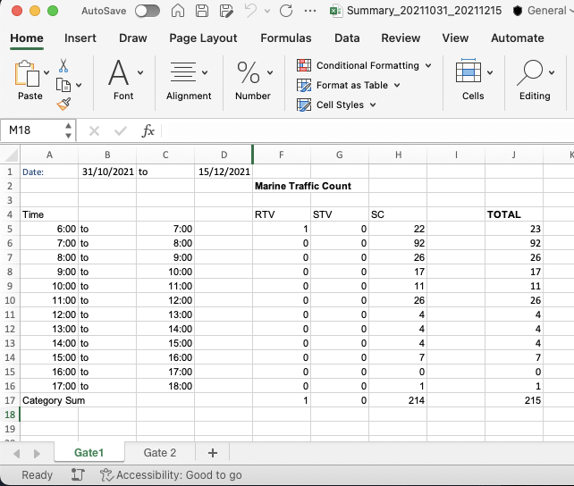

# Marine-Data-Analysis
A Data analysis and visualization project to analyze the marine traffic in the designated area.
Scripts in python language can be used in QGIS (an opensource GIS software)

<ins>Step 1</ins> 
datacleaning.py: The procedures starts with data cleaning to remove poor data (there were ships that moves faster than a rocket!)

<ins>Step 2</ins> 
readcsv_to_mysql.py: The cleaned data will then be imported into a SQL database for higher efficiency and scalability in reading learge dataset.

<ins>Step 3</ins> 
sqlexport_process.py: export from SQL database to create individual csvs for each date between start and end database depending on the specific timeframe of project

<ins>Step 4</ins> 
Move to QGIS, and run trial.py: 5 steps in total to produce results and screenshots.

